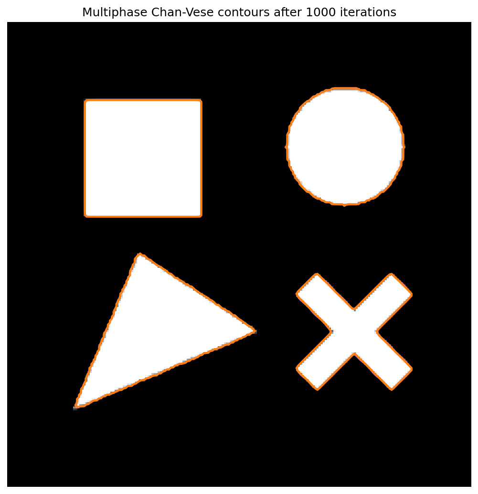
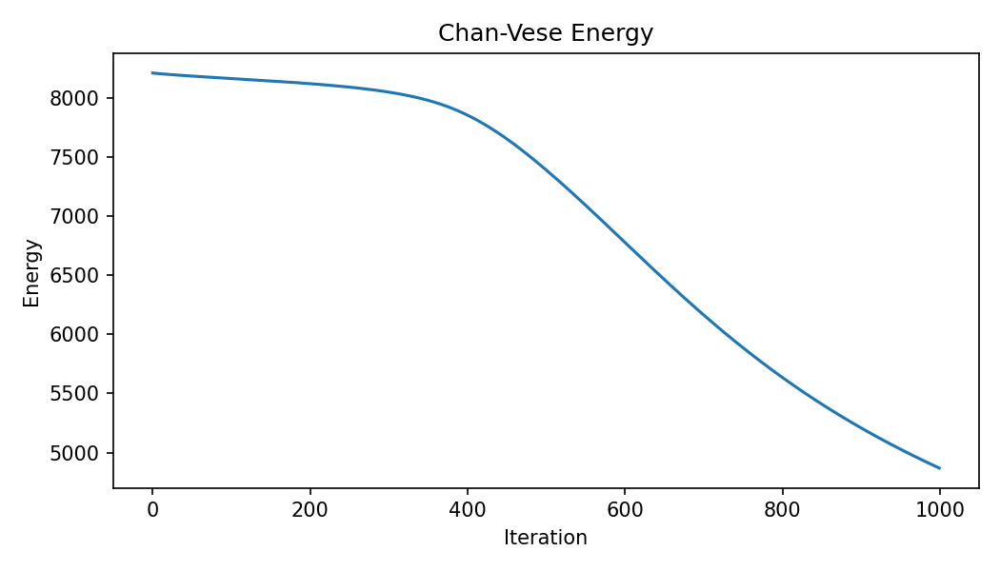

# Active Contours Without Edges

This project implements the Chan-Vese **Active Contours Without Edges** segmentation model.

Reference:

> Tony F. Chan and Luminita A. Vese,  
> "Active Contours Without Edges",  
> IEEE Transactions on Image Processing, Vol. 10, No. 2, 2001.

The method segments an image by evolving one or more level-set functions. Unlike edge-based snakes, it does not rely on image gradients. It minimizes an energy based on the average intensity of segmented regions.

---

## Project Files

```text
final_code_active_contours/
├─ main.py                      # Command-line runner
├─ chan_vese.py                 # Core Chan-Vese algorithms
├─ utils.py                     # Image loading and result saving helpers
├─ requirements.txt             # Python dependencies
├─ README.md
├─ images/                      # Input images
│  └─ synthetic_test.png
└─ results/
   ├─ mask.png                  # final binary segmentation mask
   ├─ phi.png                   # final level-set function visualization
   ├─ overlay.png               # contour drawn on the original image
   └─ energy.png                # energy curve over iterations
```

---

## Setup

Create and activate a virtual environment:

```bash
python -m venv .venv
.venv\Scripts\activate
```

Install dependencies:

```bash
pip install -r requirements.txt
```

---

## How to Run

Basic two-phase segmentation:

```bash
python main.py --input images/test.png
```

The result is saved under:

```text
results/test/
```

Choose a custom result folder name:

```bash
python main.py --input images/test.png --output test_1000
```

The result is saved under:

```text
results/test_1000/
```

---

## Two-Phase Model

The default model is `two-phase`.

It uses one level-set function `phi` and separates the image into two regions:

```text
inside contour
outside contour
```

Example:

```bash
python main.py --input images/test.png --model two-phase --max-iter 1000
```

This model works well when the image can be represented by two main intensity groups, such as foreground and background.

---

## Multi-Phase Model

The `multi-phase` option uses two level-set functions, `phi1` and `phi2`, to split the image into four possible regions.

Use this when the image has more than two natural intensity groups, for example:

```text
dark objects
bright objects
background
noise or intermediate intensity regions
```

Recommended command for the noisy multi-object example:

```bash
python main.py --input images/input.png --output input_multiphase --model multi-phase --init intensity --max-iter 200 --timestep 1 --mu 0.2
```

The `--init intensity` option initializes the level sets from image intensity quantiles. This is useful for images where objects are separated mostly by brightness.

---

## Useful Commands

Run with more iterations:

```bash
python main.py --input images/test.png --max-iter 1000
```

Use circular initialization:

```bash
python main.py --input images/test.png --init circle
```

Use checkerboard initialization:

```bash
python main.py --input images/test.png --init checkerboard
```

Change contour smoothing strength:

```bash
python main.py --input images/test.png --mu 0.2
```

Use the semi-implicit finite-difference solver:

```bash
python main.py --input images/test.png --solver semi-implicit
```

Compare with the explicit solver:

```bash
python main.py --input images/test.png --solver explicit
```

---

## Options

| Option | Default | Description |
|---|---:|---|
| `--input` | empty | Input image path. If omitted, a synthetic image is generated. |
| `--output` | input name | Result folder name under `results/`. |
| `--model` | `two-phase` | `two-phase` uses one level set and two regions. `multi-phase` uses two level sets and four regions. |
| `--init` | `checkerboard` | Initial level-set method: `checkerboard`, `circle`, or `intensity`. |
| `--max-iter` | `500` | Maximum number of iterations. |
| `--mu` | `0.25` | Contour length regularization weight. Larger values make contours smoother. |
| `--nu` | `0.0` | Area term weight. |
| `--lambda1` | `1.0` | Inside fitting term weight for the two-phase model. |
| `--lambda2` | `1.0` | Outside fitting term weight for the two-phase model. |
| `--epsilon` | `1.0` | Smoothing value for the Heaviside and Dirac delta approximations. |
| `--timestep` | `0.1` | Time step for level-set evolution. |
| `--tol` | `1e-4` | Stopping threshold based on average level-set change. |
| `--solver` | `semi-implicit` | `semi-implicit` follows the paper-style finite-difference update. `explicit` is available for comparison. |
| `--inner-iter` | `5` | Fixed-point iterations used by the semi-implicit solver. |
| `--reinit-every` | `0` | Reinitialization interval. `0` disables reinitialization. |
| `--reinit-iters` | `5` | Number of iterations used during reinitialization. |

---

## Output Files

For `--model two-phase`, the program saves:

```text
mask.png      Binary segmentation mask
phi.png       Final level-set visualization
overlay.png   Final contour over the input image
energy.png    Energy curve over iterations
```

For `--model multi-phase`, the program saves:

```text
label_mask.png         Four-region label mask in grayscale
label_mask_color.png   Four-region label mask in color
phi1.png               First level-set visualization
phi2.png               Second level-set visualization
overlay.png            Both final contours over the input image
energy.png             Energy curve over iterations
```

---

## Example Results
Visualize the result image at the execution of the command below:

```bash
python main.py --input images/test.png --output input_multiphase --model multi-phase --init intensity --max-iter 1000
```

<table>
<tr>
    <th colspan="2">Input Image</th>
    <th colspan="2">Segmentation Mask</th>
</tr>

<tr>
    <td colspan="2" align="center">
        <br>
        Original synthetic test image.
    </td>
    <td colspan="2" align="center">
        <br>
        Binary segmentation result.
    </td>
</tr>

<tr>
    <th colspan="2">Contour Overlay</th>
    <th colspan="2">Energy Convergence</th>
</tr>

<tr>
    <td colspan="2" align="center">
        <br>
        Final contour after optimization.
    </td>
    <td colspan="2" align="center">
        <br>
        Energy evolution during optimization.
    </td>
</tr>
</table>

---

## Implementation Notes

The two-phase model follows the Chan-Vese level-set formulation with regularized Heaviside and Dirac delta functions. The default update is a semi-implicit finite-difference scheme for the curvature term.

The multi-phase model extends the segmentation to four regions using two level-set functions. This is useful when one inside average and one outside average are not enough to describe the image.
