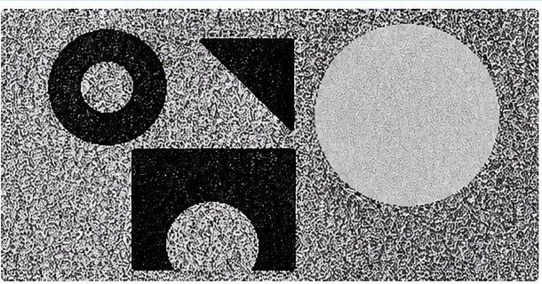

# Final Code: Active Contours Without Edges

This repository contains a Python implementation of the **Chan-Vese Active Contours Without Edges** algorithm.

The implemented model is based on:

> Tony F. Chan and Luminita A. Vese,  
> **"Active Contours Without Edges"**,  
> IEEE Transactions on Image Processing, Vol. 10, No. 2, 2001.

The goal of the algorithm is image segmentation. Unlike classical snake models, this method does **not** stop the contour using an edge detector or image gradient. Instead, it evolves a level-set function by minimizing an energy based on the average intensity inside and outside the contour.

---

## 1. Project Structure

```text
final_code_active_contours/
├─ main.py
├─ chan_vese.py
├─ utils.py
├─ requirements.txt
├─ README.md
├─ images/
│  └─ synthetic_test.png        # created automatically if no input image is given
└─ results/
   ├─ mask.png                  # final binary segmentation mask
   ├─ phi.png                   # final level-set function visualization
   ├─ overlay.png               # contour drawn on the original image
   └─ energy.png                # energy curve over iterations
```

---

## 2. Implemented Algorithm Summary

The contour is represented implicitly by a level-set function `phi`.

- `phi >= 0`: inside the contour
- `phi < 0`: outside the contour
- `phi = 0`: contour boundary

At each iteration, the algorithm computes:

```text
c1 = average image intensity inside the contour
c2 = average image intensity outside the contour
```

Then the level-set function is updated using a gradient descent equation derived from the Chan-Vese energy:

```text
F = mu * Length(C)
    + nu * Area(inside(C))
    + lambda1 * integral_inside |u0 - c1|^2
    + lambda2 * integral_outside |u0 - c2|^2
```

### Implemented Components

The following components from the original Chan–Vese model are implemented:

- Level-set representation of evolving contours
- Regularized Heaviside function
- Regularized Dirac delta function
- Region average estimation (c1, c2)
- Curvature-based contour regularization
- Energy minimization using gradient descent
- Finite difference numerical approximation
- Binary image segmentation based on region statistics

---

## 3. Windows Environment Setup

These instructions are written for **Windows OS**.

### Step 1. Install Python

1. Go to the official Python website: `https://www.python.org/downloads/`
2. Download Python 3.10 or newer.
3. During installation, check:

```text
Add Python to PATH
```

4. After installation, open Command Prompt and check:

```bash
python --version
```

Expected output example:

```text
Python 3.10.x
```

---

### Step 2. Download or Clone This Repository

If using GitHub, open Command Prompt and run:

```bash
git clone https://github.com/YOUR_USERNAME/final_code_active_contours.git
cd final_code_active_contours
```

If downloaded as a ZIP file:

1. Extract the ZIP file.
2. Open Command Prompt.
3. Move into the project folder:

```bash
cd path\to\final_code_active_contours
```

Example:

```bash
cd C:\Users\YourName\Desktop\final_code_active_contours
```

---

### Step 3. Create a Virtual Environment

Run:

```bash
python -m venv .venv
```

Activate the virtual environment:

```bash
.venv\Scripts\activate
```

If activation is successful, the command line will show something like:

```text
(.venv) C:\Users\YourName\Desktop\final_code_active_contours>
```

---

### Step 4. Install Required Packages

Run:

```bash
pip install --upgrade pip
pip install -r requirements.txt
```

The required packages are:

```text
numpy
opencv-python
matplotlib
```

---

## 4. How to Run the Code

### Option A. Run with the Automatically Generated Test Image

If no input image is provided, the program automatically creates a synthetic test image.

```bash
python main.py
```

After execution, check the `results/` folder.

Generated output files:

```text
results/mask.png
results/phi.png
results/overlay.png
results/energy.png
```

---

### Option B. Run with Your Own Image

Put your image into the `images/` folder.

Example:

```text
images/test.png
```

Then run:

```bash
python main.py --input images/test.png --output results
```

---

## 5. Example Commands

### Basic execution

```bash
python main.py --input images/test.png
```

### Increase the maximum number of iterations

```bash
python main.py --input images/test.png --max-iter 1000
```

### Use a circular initial contour

```bash
python main.py --input images/test.png --init circle
```

### Use checkerboard initialization

```bash
python main.py --input images/test.png --init checkerboard
```

### Change the length regularization parameter

```bash
python main.py --input images/test.png --mu 0.2
```

### Enable approximate reinitialization every 50 iterations

```bash
python main.py --input images/test.png --reinit-every 50 --reinit-iters 5
```

---

## 6. Parameter Explanation

| Parameter | Default | Description |
|---|---:|---|
| `--mu` | `0.25` | Weight for contour length regularization. Larger values make the contour smoother. |
| `--nu` | `0.0` | Weight for the area term. Positive or negative values can encourage shrinking or expanding. |
| `--lambda1` | `1.0` | Weight for the inside fitting term. |
| `--lambda2` | `1.0` | Weight for the outside fitting term. |
| `--epsilon` | `1.0` | Smoothing parameter for Heaviside and Dirac delta approximations. |
| `--timestep` | `0.1` | Time step for gradient descent update. |
| `--max-iter` | `500` | Maximum number of iterations. |
| `--tol` | `1e-4` | Stopping threshold based on average change in `phi`. |
| `--init` | `checkerboard` | Initial level-set method: `checkerboard` or `circle`. |
| `--reinit-every` | `0` | Reinitialization interval. `0` disables reinitialization. |

---

## 7. Output File Explanation

### `mask.png`

Binary segmentation result.

- White: inside segmented region
- Black: outside region

### `overlay.png`

Original image with the final zero-level contour drawn over it.

### `phi.png`

Visualization of the final level-set function.

### `energy.png`

Energy value over iterations. This is useful for checking whether the optimization process is stabilizing.

---

### Example Result

<p align="center">
  
  
</p>

<p align="center">
  
  
</p>
#### Input Image


#### Final Contour


#### Segmentation Mask


#### Energy Convergence


---

## 8. Notes on the Implementation

This implementation is designed to be clear and reproducible for coursework.

The original paper presents a finite-difference numerical approximation of the level-set PDE. This code follows the same model structure and implements the main Chan-Vese update equation using explicit finite differences.

The code is divided as follows:

- `chan_vese.py`: core algorithm
- `utils.py`: image reading, result saving, visualization
- `main.py`: command-line interface
- `requirements.txt`: Python package list

---

## 9. Troubleshooting on Windows

### Problem: `python` is not recognized

Python was not added to PATH.

Solution:

1. Reinstall Python.
2. Check `Add Python to PATH`.
3. Restart Command Prompt.

---

### Problem: virtual environment activation is blocked

If PowerShell blocks script activation, use Command Prompt instead.

Recommended:

```bash
cmd
.venv\Scripts\activate
```

Or in PowerShell:

```powershell
Set-ExecutionPolicy -Scope CurrentUser RemoteSigned
.venv\Scripts\Activate.ps1
```

---

### Problem: `ModuleNotFoundError`

Required packages are missing.

Run:

```bash
pip install -r requirements.txt
```

---

### Problem: Image path error

Make sure the file exists.

Example correct command:

```bash
python main.py --input images/test.png
```

---

## 10. Suggested GitHub Submission Steps

After confirming that the program runs correctly:

```bash
git init
git add .
git commit -m "Implement Chan-Vese active contours without edges"
git branch -M main
git remote add origin https://github.com/YOUR_USERNAME/final_code_active_contours.git
git push -u origin main
```

Submit the GitHub repository link to the LMS assignment board.

---

## 11. Example LMS Submission Text

```text
I submit the GitHub repository link for the final code assignment.

Repository:
https://github.com/Jossubin/Active_Contour_Algorithm.git

The repository includes:
- Complete Python source code
- README.md with Windows setup and execution instructions
- requirements.txt
- example input/output structure
```
